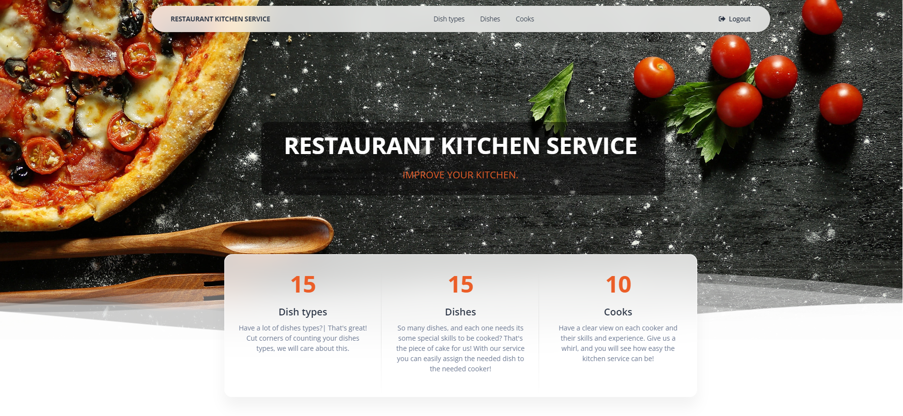

# Restaurant Kitchen service
Django project for managing dish types, dishes, cooks.

## Check it out!

[Restaurant kitchen service deployed to Render](https://restaurant-kitchen-service-h2jz.onrender.com/)
## Installing / Getting started
Python3 must be already installed
```shell
git clone https://github.com/yuraua5/restaurant-kitchen-service.git
cd restaurant_kitchen_service
python3 -m venv venv
source venv/bin/activate (on macOS)
venv\Scripts\activate (on Windows)
pip install -r requirements.txt
python manage.py migrate
python manage.py runserver
```


## Features

This project will help you to manage  the restourant kitchen service. Here are included the following categories and funcrtionality: 
Dish types:
- Possibility to view the list of dish types, view their description
- Update the dish type
- Delete the dish type 
- Add a new dish type
- See the list of dishes of the selected dish type

Dishes:
- Possibility to view the list of dishes , view their description
- Update the dish 
- Delete the dish 
- Add a new dish 
- Assign the cooks

Cooks
- View the list of cooks
- Update the cook
- Delete the cook
- Add a new cook

## Demo
link
To log in use this:
```
username: guest
password: guestpassword1234
```
